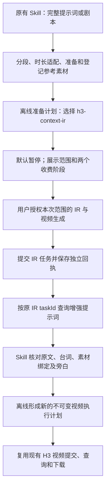

# H3 Context IR 多模态视频流程：最小稳定实施方案

日期：2026-09-19。状态：**待实施的方案，不代表当前程序已经支持这些新命令或完成真实接口验收。**

实施记录补充（2026-09-19）：下文保留交接时的方案与范围；最小流程现已完成离线实现。当前可用命令与核对契约见 [CONTEXT_IR_WORKFLOW.md](CONTEXT_IR_WORKFLOW.md)，实际测试和仍待真实验证的部分见 [VERIFICATION.md](VERIFICATION.md#独立-context-ir-流程2026-09-19)。本方案及离线实施均不构成收费调用授权。

本次只新增本文档。按当前 `E:\metasocli` 源码设计，保留已完成的小数时长、参考图片、旁白及任务恢复功能。开发和离线验收先完成；本方案不授权调用收费 IR、图片或视频接口，不授权改动旧安装或推送 GitHub。

## 1. 采用的方案

在现有视频提交前增加一个独立的 Context IR 步骤，保存并核对增强提示词，再生成不可变的视频执行计划，进入现有视频任务链。



用户继续使用 `$metasocli-video-prompts`、`$metasocli-video-prompts-旁白`；剧本入口 `$metasocli` 同样接入这条执行链。默认停在 IR 和视频付费调用之前。用户明确授权整个流程后，Skill 自动完成中间核对和后续调用，正常情况不增加逐段人工确认。

`MiniMax-H3` 仍是视频模型，继续使用 Node.js / TypeScript / Zod 和当前 Metaso 凭据。图片配方、图片生成 Skill、素材登记、故事导入和时长适配继续复用。既有普通 H3 计划和任务仍按原有方式恢复。

这次范围是当前已有的参考图片，以及旁白段已有的单条参考音频。截图中的 `reference_video` 只是示例素材；接入 IR 不要求新增参考视频资产。参考视频、多音轨、尾帧、模型更换及后台常驻服务均不属于本次实施内容。

本次目标段沿用 `references` 模式进入 IR 和视频两个阶段。其他已有段若使用纯文本或首帧，仍按真实素材角色标注对应模式，不为凑“多模态”而改写角色或添加素材；用户要求全部段都采用多模态参考时，在准备阶段报告缺少的参考输入。

## 2. 已核实的项目与接口事实

| 当前代码位置 | 已有行为 | 对实施的约束 |
| --- | --- | --- |
| `src/metaso/client.ts` | `create()` 提交 `video_generation`；`query()` 成功时要求视频 URL | 增加独立的 IR 创建、查询方法，不能把 IR 文本当视频 URL |
| `src/metaso/h3.ts` | 构造有序图片和可选旁白音频，计算实际请求哈希 | 两阶段使用同一组素材及顺序；只在视频阶段替换文本 |
| `src/core/planning.ts` | 计划不可变，提交前重建请求并核对清单、原文和素材 | IR 完成后必须产生新的执行计划，不能覆盖原计划的提示词和哈希 |
| `src/jobs/submit.ts` | 授权检查、项目锁、意图落盘、单次创建、回执落盘 | IR 也需要这些保证；视频阶段继续调用现有提交逻辑 |
| `src/jobs/resume.ts` | 根据已有任务 ID 查询与下载，不调用创建接口 | 保留此语义；恢复 IR 成功也不能擅自创建下一阶段的视频 |
| `src/story/narration.ts` | `cues` 是原始提示词的 UTF-16 范围 | 不得把旧偏移套在 IR 改写后的文本上 |
| `src/story/duration.ts` | 小数目标时长向上取整为合法的 4–15 秒 | IR 与视频都使用同一个执行时长，不再改动这项规则 |

独立 `h3_context_ir` 接口创建的是提示词增强任务，成功结果在 `content.prompt`；它不会直接创建视频。结果需要再作为文本输入交给视频创建接口。模型字段仍为 `MiniMax-H3`。[MiniMax 官方 IR 契约](https://platform.minimax.cn/docs/api-reference/video-generation-v2-h3-context-ir)

官方查询接口按任务 ID 查询不同任务类型；实现必须区分 IR 的 `task_type=h3_context_ir`、文本结果，与生成任务的视频结果。查询也有服务端可查询时间范围，应尽早本地保存结果，不能承诺永久远端恢复。[MiniMax 官方查询契约](https://platform.minimax.cn/docs/api-reference/video-generation-v2-query)

项目现有 `parameters.contextIr` 映射为视频请求内的 `context_ir_enabled`。它与本方案的“独立 IR 任务 → 视频任务”采用不同的客户端流程，不能只修改这个布尔值就宣称完成独立接口接入。

### Metaso 路由核验

当前代码的视频地址是 `https://metaso.cn/api/minimax/v2/video_generation`。用户截图中的 IR 示例是 `/minimax/v2/h3_context_ir`，与现有地址存在 `/api` 差异。截图和官方模型契约不能单独证明 Metaso 代理端两种路径都可用。

实施时先核对 Metaso 当前公开说明及其页面示例，记录 IR 创建和查询的具体 URL、依据及日期。IR 路由单独定义，视频路由保持原配置；不得为适配 IR 全局更换 API 基地址，也不得在一次收费调用不确定后自动尝试另一条路径。若公开资料不能消除差异，完成离线适配并将真实路由支持标为待验收，待有明确授权时做一次受控验收。[Metaso H3 页面](https://metaso.cn/minimax-h3)

沿用 Metaso API Key 和独立凭据加载机制，不把密钥发送到 MiniMax 官方域名，不抄录截图里的令牌。

## 3. 最小数据改动

### 3.1 保留故事和旧任务格式

不修改 `metasocli.yaml` 的必填字段，不改原文快照、`prompt`、`promptHash`、来源范围、素材记录和旁白 `cues`。旧 `JobSchema` 继续只记录视频任务；IR 记录放在自己的目录，避免旧 `listJobs()` 把文本任务当视频任务解析。

不把旧计划批量升级或补写字段。既有 `parameters.contextIr` 的含义与默认值保持原状。

### 3.2 计划仅增加可选的流程标记

在现有 `Plan` 顶层增加一个**无默认值**的可选 `workflow` 判别对象，使用下面三种情况：

| 计划类型 | 表达方式 | 用途 |
| --- | --- | --- |
| 既有普通计划 | 没有 `workflow` | 原有普通 H3 创建与恢复 |
| IR 准备计划 | `workflow: { type: "h3-context-ir", stage: "prepare" }` | 完整保存原始渲染输入、素材和参数，作为 IR 输入依据 |
| IR 后的视频计划 | `workflow.type="h3-context-ir"`、`stage="video"`，附来源信息 | 保存增强后的实际视频请求摘要，交给现有视频任务模块 |

来源信息至少包含准备计划 ID/哈希、段 ID、IR operationId/taskId、增强提示词哈希、核对记录路径/哈希。路径由程序在故事状态目录内生成，不能接受任意外部结果路径冒充 IR 结果。

准备计划的现有段摘要是“增强前的 H3 输入摘要”：其中 `requestHash` 仅校验这个基础请求，**不是 IR POST 的哈希，也不是未来视频 POST 的哈希**。输出必须标清阶段。IR 请求的哈希另行计算并写入 IR 任务；最终视频哈希在派生计划中重新计算。

`submit()` 必须在任何已存在任务匹配/返回之前拒绝 `stage=prepare`，防止误将准备计划直接提交为普通视频。新增流程不会改写旧计划的哈希算法；无新字段的旧计划解析后仍保持原字节含义。

新 IR 准备模式要求各段的内联 `contextIr=false`。如输入显式设置为 true，返回明确的设置冲突，要求选择单一增强方式，不静默叠加。派生视频请求显式发送 `context_ir_enabled:false`。

### 3.3 新增 IR 记录，复用现有文件存储工具

建议目录：

```text
.metasocli/
  plans/                         既有计划与新增派生计划
  jobs/                          既有视频任务，格式不变
  receipts/                      既有视频回执
  context-ir/
    operations/<operationId>.json
    receipts/<operationId>.json
    prompts/<operationId>.txt
    reviews/<operationId>-<reviewHash>.json
```

新增目录按需建立；旧故事不存在这些目录时按没有 IR 记录处理。

IR 任务至少记录：项目、准备计划及其哈希、集/段、revision、原文哈希、`irRequestHash`、稳定的 `inputHash`、尝试次数、状态、提交时间、独立 IR taskId、回执、结果文件路径/哈希，以及派生计划 ID/哈希。

稳定的 `inputHash` 绑定流程版本、原始段 inputHash 和实际 IR 请求哈希；不能包含新生成的计划 UUID 或时间戳作为去重依据。同一项目同一段输入未变时，新建等价准备计划或重复执行也应找到既有 IR 尝试；失败的重新创建仍须显式重试。此哈希只保证本地识别，不能冒充服务端幂等键。

IR 结果先按原始文本保存，核对记录另存。复用 `projectPath`、稳定读取、原子写入、SHA-256 和现有项目锁。不增加数据库、队列或新的外部服务。

## 4. 两阶段请求如何构造

### 第一阶段：Context IR

从已验证的准备计划重建原始 H3 请求，取其有序 `content`、`model`、执行 `duration` 和有效 `ratio` 构造 IR 请求。不要将完整视频请求不加区分地透传。

IR 的独立 Zod 契约只接受本次已核实并使用的字段。当前视频请求中的 `resolution`、`aigc_watermark` 和 `context_ir_enabled` 不发送给 IR。模型与素材边界继续使用当前项目的约束。[IR 请求契约](https://platform.minimax.cn/docs/api-reference/video-generation-v2-h3-context-ir)

`content` 中的文本是现有 `renderPrompt()` 的结果，已包含正确的素材引用，以及有旁白时的声线适用说明。图片和音频使用现有登记内容，不重新生成、不换序、不自动上传到额外服务。

增加类型独立的 `createContextIr()`、`queryContextIr()`，让旧 `VideoClient.create/query` 和假客户端继续兼容。可共用 HTTP 请求、脱敏和错误分类，但不要把 IR 的 prompt 填进视频 Observation 的 url。

IR 成功响应必须核对任务身份、模型、类型及非空文本结果；遇到不认识的状态或结构保存脱敏证据并进入未知查询状态，不能把它记为成功。任务查询有界退避；创建不自动重发。

### 第二阶段：现有 H3 多模态视频生成

IR 结果核对通过后，用同一份基础请求构造视频请求：

1. 将唯一 `text` 内容替换为已保存、已核对且哈希一致的 IR 提示词。
2. 保留全部图片/音频项的角色、字节身份和顺序。
3. 保留原执行时长、比例、清晰度和水印参数。
4. 显式设置 `context_ir_enabled:false`，避免再次内联增强。
5. 重新校验字符数、媒体边界及请求总大小，计算真实视频 `requestHash`、`inputHash` 和摘要。

每个已完成 IR 的段生成一份单段视频计划，便于局部恢复；准备计划仍覆盖原集的全部段落。最终执行仍为当前 `video_generation` 接口，模型仍为 `MiniMax-H3`。

`buildRequest()` 的普通路径不变。可抽出小型的请求摘要函数供派生构造复用；不要通过临时修改 `StorySegment.prompt` 或伪造 promptHash 来复用渲染器。

`validatePlan()` 按计划类型分支：普通/准备计划沿用原文校验；派生计划先验证其准备计划、当前清单/素材、IR 结果与核对记录，再按上述规则重建对应段的实际请求，精确比对派生计划摘要。父计划必须是准备类型，只允许一层派生，拒绝循环引用。

## 5. 原文、台词、旁白与素材的核对

保存原文只能保证追溯，不等于 IR 一定正确保留所有台词和镜头。因此在两个收费阶段之间增加**由当前宿主 Skill 执行的核对**，不再接一个收费文本模型。

Skill 对照原始提示词、基础渲染文本和 IR 输出，逐段检查：

- 台词、说话人、顺序、明确动作与镜头约束是否保留，有没有新增冲突内容。
- 人物、场景、道具与参考图序号是否一致，是否引入了不存在的素材。
- 有旁白的段是否仍将参考音频仅用于对应画外旁白；角色对白不能被统一旁白声线取代。
- 无旁白段是否保持无旁白音频，音频是否被错误理解为整段背景音或要求复述录音内容。
- 既定段落、时间关系、实际执行时长和用户明确限制是否发生冲突。

核对记录绑定准备计划哈希、段 ID、源 promptHash、IR operationId 和结果哈希，记录具体核对依据及 `approved` / `needs_review` 结论。CLI 只接受身份、哈希和结构完整的通过记录，并对已知旁白原句、非法引用、文本长度等可程序验证的条件做确定性检查。不能将几个布尔值声称为语义完整性的数学证明。

旁白 `cues` 继续指向原始提示词；程序从原文提取旁白句用于比对，不重新计算其在 IR 文本中的偏移，不在增强文本上调用旧的 `narrationDirection()`。最终请求不重复追加整套原文或旁白列表，防止重复朗读和超长。

核对正常通过时自动继续，不增加用户批准节点。确有台词丢失、音频归属错误、超长或冲突时保留 IR 结果并停止视频创建，报告具体差异；不截断、不自行改写台词、不自动再次付费跑 IR。必要的内容修订与再次付费尝试按用户实际授权处理。

小数时长仍由现有程序处理，例如 `12.378 / 6.666 / 6.963` 秒继续对应执行 `13 / 7 / 7` 秒。两个阶段使用同一组执行值；原目标值、原文和旁白录音长度分别保留。

## 6. 授权、恢复和并发

### 授权边界

准备计划展示流程名称、段范围、素材、执行时长和“IR 增强 + 视频生成”两个收费阶段。之前仅授权普通视频的历史任务，不自动视为允许新增 IR 费用；本次制定方案也不是收费执行授权。

用户明确授权这个新流程的范围后，Skill 可用同一次授权依次执行 IR 和视频，无需每段再问。IR 查询超时或进程退出后仍可按原授权范围继续，但必须显式走相应创建命令；普通 `resume/status/download` 不得因为读到 IR 成功就创建视频。

### IR 状态

IR 采用独立的状态记录，至少区分 `prepared`、`submitting`、`submit_unknown`、`queued`、`running`、`query_unknown`、`enhanced`、`failed`、`cancelled`。`enhanced` 表示结果已本地保存，**不表示核对通过或视频已完成**。核对结果和派生计划链接作为独立字段，不混入视频下载状态。

| 情况 | 正确行为 |
| --- | --- |
| IR 创建发出后超时，无法确定是否被接受 | 保存 `submit_unknown`，禁止重发；核对远端任务 ID |
| 已拿到 IR taskId，但任务记录写入失败 | 优先依靠独立回执恢复，保留受控诊断中的 ID |
| 已知 IR taskId，查询限流、超时或状态未知 | 只查同一 ID，有界重试，不再次创建 |
| IR 完成后进程退出 | 复用已保存的结果和哈希，继续核对/派生计划 |
| IR 已成功，核对未通过 | 停在核对阶段，不误标供应商任务失败，不自动再收费 |
| 派生计划写入前后中断 | 根据事先落盘的候选 planId/createdAt 重建或验证同一计划 |
| 视频已提交或已下载，重新执行整段流程 | 找到既有 IR 及视频记录，按其阶段恢复 |
| 视频下载失败 | 只恢复原视频下载，不重做视频或 IR |
| 视频明确失败，用户允许再生成 | 对原视频操作显式重试，复用已通过的 IR 结果 |
| 任一阶段素材/原文改变 | 禁止新的付费创建；已接受任务仍能查询和取回结果 |

读取既有视频任务时只需其原计划和任务身份，不能让已经提交的视频恢复依赖当前原文或重新跑 IR 核对。保持现有 `resume()` 的这个边界。

IR `attach-task` 除项目和请求归属外，还必须核对远端任务确为 IR 类型，避免把视频 ID 挂在 IR 记录上。两个命名空间都检查远端 taskId 重复；本地 operationId 若跨命名空间冲突，明确报错。

### 锁与去重

IR 每次创建和视频每次创建都使用现有项目锁，先保存意图，再创建一次，再优先保存回执。为两个创建入口增加一个小型共同冲突检查：任一阶段存在未知提交时阻止新的付费创建，同段有未完成远端任务时先恢复。

必须在锁内重新检查冲突；仅在 Skill 层按顺序调用不足以保证并发安全。IR 准备和核对已完成后的关联视频提交应允许通过，不能被自己的父 IR 记录永久阻塞。

现有项目锁不可重入。外层 Skill/CLI 协调不要持锁再调用 `createPlan()`、`submit()` 或 `resume()`。每个持久化/提交阶段自己持锁，跨阶段依靠落盘身份和哈希连接。

派生计划创建在锁内先记录候选 UUID 和创建时间，再保存不可变计划，再回写计划哈希；重复调用使用同一候选身份。双进程同时核对/派生以及写入途中退出，都不能生成两个不同的付费尝试。

## 7. 最小 CLI 和 Skill 交接

下面均为**拟实现接口，当前不可直接当作已存在命令运行**。现有普通计划与视频命令保留。

| 拟实现入口 | 行为 |
| --- | --- |
| `plan --root <story> --episode <id> --workflow h3-context-ir` | 离线创建准备计划，不读取密钥或创建远端任务 |
| `context-ir --root <story> --plan <prepare-id> --segment <id> --confirm` | 校验授权、提交或复用该段 IR、有限轮询、保存结果；不创建视频 |
| `plan --root <story> --from-context-ir <ir-operation-id> --review <review.json>` | 离线校验核对记录，创建或复用该段派生视频计划 |
| `generate --root <story> --plan <derived-video-id> --confirm` | 沿用现有视频创建、轮询和下载 |
| `status/resume --root <story> --operation <id>` | 按 operationId 分派 IR 或视频；普通本地 status 不联网，远端查询遵循已有显式选项 |
| `attach-task --root <story> --operation <id> --task <provider-id> --confirm-task-link` | 按记录类型核对并恢复远端 ID |
| `download --root <story> --operation <video-id>` | 只接受视频任务；IR 没有视频可下载 |

IR 创建命令复用已有轮询参数格式；支持 `--submit-only` 时只提交 IR 并保存回执。IR 重试采用 `--retry-of <ir-operation-id>`，仅允许最近一次明确失败/取消的尝试；视频继续使用现有 `generate --retry-of`。未知结果不能通过 retry-of 绕过。

IR 准备计划传给 `generate` 时返回明确错误和下一步命令，不自动降级直出视频。`plan --episode` 与 `plan --from-context-ir` 参数互斥，所有参数在任何付费调用前校验。

三个业务入口调用同一组命令：离线准备阶段使用新流程选项；付费授权后逐段“IR → 核对 → 派生计划 → 原 generate”。无需让用户另记一个 IR Skill 名称。普通入口仍不自动绑定统一旁白；旁白入口仍只为明确有旁白的段绑定。

仅更新本项目 `skills/` 中相关入口的正文。现有用户级包装入口按已安装的引用方式读取新正文；若实际引用方式不同，先检查再处理，不重装旧 Skill、不改 LibTV 包装入口。项目 `.agents/skills` 的加载配置如无需变更就保留。

## 8. 文件级实施范围

建议新增四个职责明确的模块；允许按现有风格拆分测试，不建设通用工作流框架。

| 文件 | 工作 |
| --- | --- |
| 新增 `src/contracts/context-ir.ts` | IR 请求/任务/回执/核对记录契约，必要的导出类型 |
| 新增 `src/metaso/context-ir.ts` | 从基础 H3 请求构造 IR 请求、结果校验及派生文本输入的窄接口 |
| 新增 `src/jobs/context-ir-store.ts` | 独立目录、原子保存、回执协调、结果及核对文件身份校验 |
| 新增 `src/jobs/context-ir.ts` | IR 提交、查询恢复、显式重试和人工挂接 ID；支持可注入假客户端 |
| `src/metaso/client.ts` | 新增 IR 专用方法、独立路由定义，复用现有 HTTP 与脱敏 |
| `src/contracts/plan.ts`、`src/core/planning.ts` | 可选 workflow、准备/派生计划及各自校验 |
| `src/metaso/h3.ts` | 小范围复用请求摘要；以核对通过的 IR 文本构造最终 H3 请求 |
| `src/jobs/submit.ts` | 拒绝准备计划；锁内加入 IR 冲突检查，保留视频状态与回执语义 |
| `src/cli/main.ts`、`src/core/index.ts` | 新命令、参数、结构化结果和按任务类型分派 |
| 三个入口的 `skills/*/SKILL.md` | 新流程与自动核对、授权范围、失败恢复说明 |
| README、`docs/METASO_CONTRACT.md`、`docs/VERIFICATION.md` | 实际命令、路由证据、离线和真实验证状态 |

如跨阶段冲突检查需要共用，可增加一个很小的 `src/jobs/submission-guard.ts`，避免相互递归调用完整的提交函数。无需改写现有下载器，不为本次引入新 npm 依赖或变动锁文件。

## 9. 必须完成的离线验收

使用假客户端和全新临时故事，不读写 mttest1、mttest2、test34 或其他业务故事。测试计数应能证明两个收费创建分别发生了多少次。

| 测试组 | 必须证明的结果 |
| --- | --- |
| 原有回归 | 现有构建、测试、图片 Skill 和进程隔离测试继续通过 |
| 零付费准备 | init/import/素材检查/新 plan/派生 plan 不调用 IR create 或 video create |
| 请求契约 | IR 请求字段正确；同组有序素材出现在两个阶段；最终视频内联 IR 为 false |
| 正常流程 | 一个多图段恰好创建 1 次 IR + 1 次视频；结果从 prompt 正确转为视频请求文本 |
| 旁白 | 有旁白段两阶段均带原音频；无旁白段均不带；原 cues/hash 不变；对白归属核对失败能阻止视频创建 |
| 文本边界 | 空结果、超限结果、台词/旁白丢失、非法引用及未通过的核对记录都不进入视频创建；不截断 |
| 时长回归 | 12.378/6.666/6.963 仍为 13/7/7，IR 与视频一致，原目标和录音时长不变 |
| 错类型与未知响应 | IR/video 结果不能互相冒充；未知状态保存证据并可恢复 |
| 未知提交 | IR 和视频分别模拟已发出但回执未知，重复调用不多产生一次创建 |
| 中断恢复 | taskId 回执落盘前后、IR 结果保存后、派生计划预留/保存/回写之间的中断均可识别原阶段 |
| 并发 | 两进程同时提交、重复创建等价准备计划、同时派生计划，均不会多收费；跨阶段未知任务会阻止新创建 |
| 授权与恢复 | 未授权拒绝两个创建入口；普通 resume/status/download 均不会创建后续阶段 |
| 变化与篡改 | 原文、媒体、远端 URL 字节、IR 文件或 review 哈希变化均阻止新付费；已接受任务仍可查询取回 |
| 视频重试与下载 | 视频重试复用 IR；下载失败只恢复下载；IR 成功核对失败不自动重跑 |
| 旧计划兼容 | 使用升级前正常/旁白整数计划固定样本，验证原 planHash/inputHash 不变，原视频可恢复 |
| 项目隔离 | 隐藏旧 CLI/禁止读取旧源码仍通过；旧 Git 状态、命令路径、已安装旧 Skill 和配置基线不变 |

使用当前已有命令：

```powershell
Set-Location -LiteralPath E:\metasocli
npm run check
npm run test:image-skill
npm run test:process
powershell -NoProfile -ExecutionPolicy Bypass -File scripts/package-smoke.ps1
git -c safe.directory=E:/metasocli diff --check
```

上述脚本运行前先检查实际文件；隔离安装测试只使用临时 prefix 和临时用户目录。对于测试环境权限导致的失败，报告真实原因并通过适当的授权执行同一个必要检查，不隐藏失败、不修改全局 Git safe.directory 来消除提示。

## 10. 实施和交付顺序

1. 读取项目约束与本文，核对当前未提交修改并记录本次改动前的源码/旧环境基线。保护当前已验证的时长与素材实现，不 reset、不回退重写、不另起并行写任务。
2. 核实公开接口契约和路由证据，先做独立 IR 契约、HTTP 假响应测试。
3. 完成 IR 独立任务记录与恢复；验证意图/回执未知、限流、重复调用及并发。
4. 完成可选计划标记、核对记录、单段派生计划与提交前重建校验；验证原计划不被改写。
5. 接 CLI 和三个业务 Skill，明确默认暂停点、全流程授权和普通 resume 的只恢复语义。
6. 完成上表的离线验收，更新实际命令与验证记录，列出剩余的 Metaso 路由、媒体传输和真实生成验收项。
7. 得到另外的真实执行授权后，才用指定素材和明确范围完成最小真实 IR → 视频闭环。其结果单独记录，不能用离线测试替代；不自动扩大到批量业务故事。

完成本次开发的标准是：两个原入口能够离线准备新流程，并在假客户端下验证 IR、核对、视频及恢复闭环；原有入口能力和历史任务兼容；真实服务支持情况如实标注。

## 11. 可直接交给 ts1 的执行指令

```text
只由 ts1 在当前 E:\metasocli 执行，不向 ts2 或其他任务转交，不再分叉，也不启动并行写代码的代理。

先完整读取 AGENTS.md、START_HERE.md、docs/ARCHITECTURE.md、docs/SOURCE_BASELINE.md，以及 docs/CONTEXT_IR_WORKFLOW_HANDOFF.md，再检查当前源码与未提交修改。以当前已经实现的时长适配、参考图和旁白能力为基线，不回退重写，不覆盖其他任务已留下的修改。

按照 CONTEXT_IR_WORKFLOW_HANDOFF.md 实现最小的独立 Context IR 流程：当前素材准备与离线计划之后暂停；用户明确授权该范围的 IR 和视频后，创建并恢复独立 IR 任务，保存增强提示词，由原入口 Skill 核对原文/台词/引用/旁白，离线形成带来源证明的不可变单段视频计划，再调用既有 H3 视频提交、查询和下载。最终视频请求明确关闭内联 context_ir_enabled。不要仅把旧布尔开关改为 true 或仅替换原 video_generation URL。

保留原 Story、原始 prompt/hash/cues、时长向上取整和旧视频任务格式。为 Plan 增加无默认值的可选 workflow，旧计划哈希不能变化。IR 准备计划不得直接提交为视频；派生计划必须能重建验证。IR 和视频分别持久化意图与回执；创建结果未知不重发；普通 resume/status/download 不创建新任务。实现锁内跨阶段冲突检查，避免不可重入项目锁嵌套。

沿用 Node.js/TypeScript/Zod、现有 Metaso 凭据和图片 Skill，先不新增依赖、数据库、New API、参考视频、尾帧、多音轨或常驻服务。普通入口和独立旁白入口名称不变；只有有旁白的段带原旁白资产。默认停止点在收费 IR 之前，核对正常通过不增加用户逐段批准环节。

先完成全部离线契约、恢复、并发和隔离测试，运行现有 check、image-skill、process 和临时安装测试。核验 Metaso IR 路由时使用公开资料，截图路径和项目路径的 /api 差异不能靠未授权收费探测解决；未证实部分明确记录为待真实验收。

不得发起真实付费 IR、图片或视频生成，不修改 mttest1/mttest2/test34 的业务数据，不修改 E:\libcli 及其安装、Skill、配置、凭据或 Git，不覆盖旧全局命令，不推送 GitHub。只在 E:\metasocli 及测试临时目录写入。完成后列出实际修改、实际测试结果、旧环境基线比对和仍未真实验证的事项。
```
